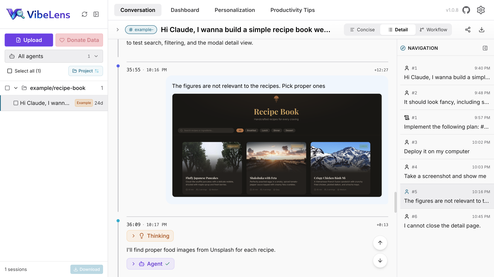
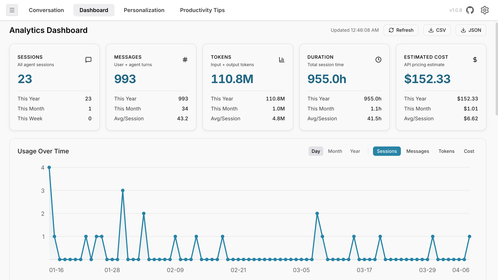
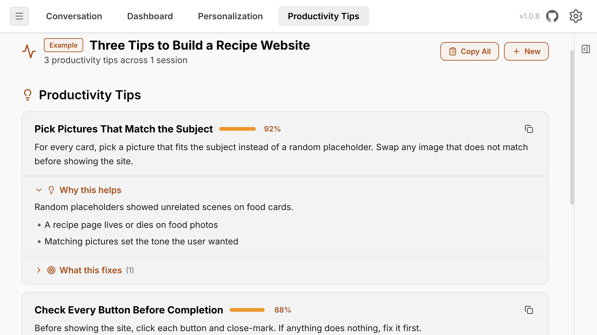
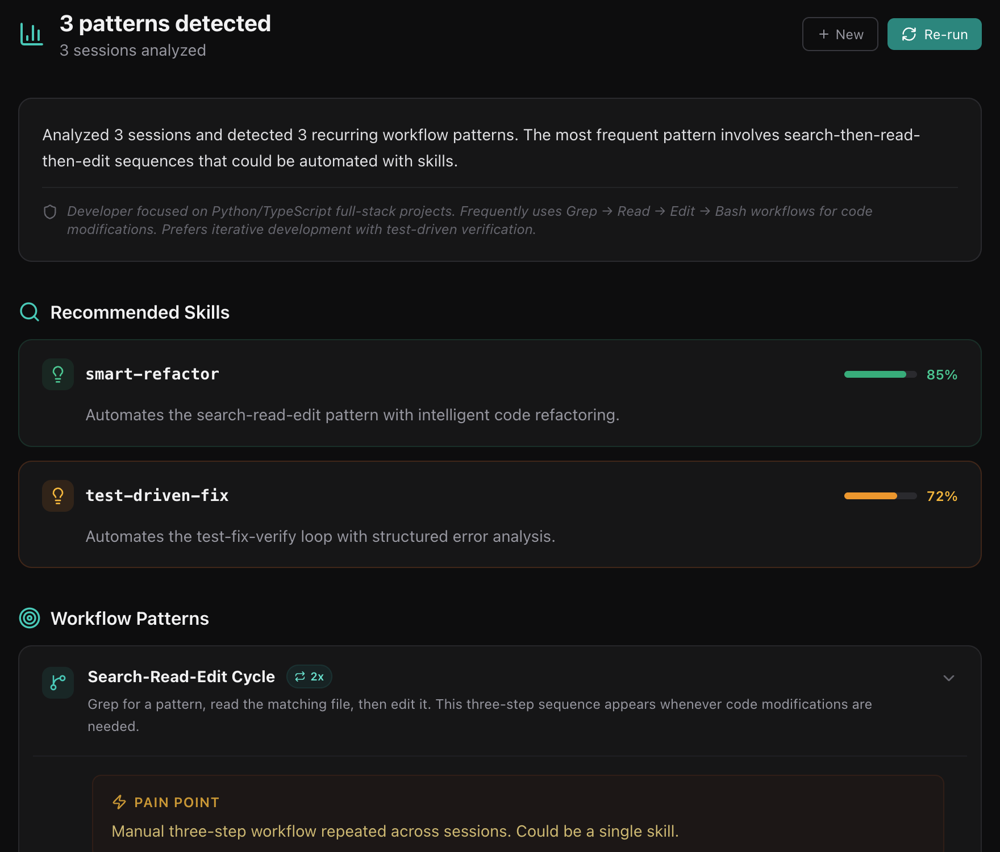
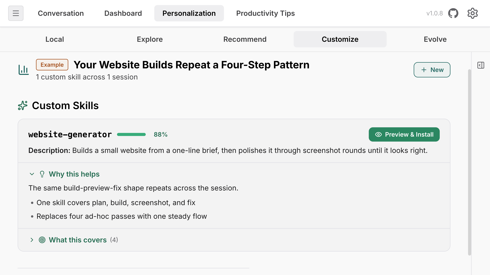
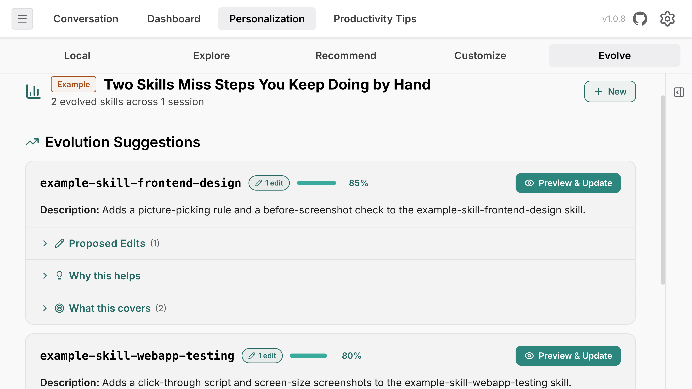

<p align="center">
  
</p>

<h1 align="center">VibeLens</h1>

<p align="center">
  <strong>See what your AI coding agents are actually doing.</strong><br>
  Replay. Analyze. Evolve.
</p>

<p align="center">
  <a href="https://pypi.org/project/vibelens/"></a>
  <a href="https://pypi.org/project/vibelens/"></a>
  <a href="https://www.npmjs.com/package/@chats-lab/vibelens"></a>
  <a href="https://opensource.org/licenses/MIT"></a>
  <a href="https://vibelens.chats-lab.org/"></a>
</p>

<p align="center">
  <a href="https://vibelens.chats-lab.org/">Live Demo</a> &middot;
  <a href="#quick-start">Quick Start</a> &middot;
  <a href="#supported-agents">Supported Agents</a> &middot;
  <a href="#screenshots">Screenshots</a> &middot;
  <a href="#data-donation">Donate Data</a> &middot;
  <a href="docs/HUMAN_STUDY.md">Human Study</a> &middot;
  <a href="https://pypi.org/project/vibelens/">PyPI</a> &middot;
  <a href="https://www.npmjs.com/package/@chats-lab/vibelens">npm</a> &middot;
  <a href="CHANGELOG.md">Changelog</a>
</p>

<p align="center">
  <a href="README.md">English</a> &middot;
  <a href="README.zh-CN.md">中文</a>
</p>

---

<p align="center">
  
</p>

<p align="center"><em>Let your agent know you better!</em></p>

---

**VibeLens** is an open-source tool that visualize and analyze your AI agent sessions. It reads your existing session logs, and supports **11 local agents** out of the box (Claude Code, Codex, Gemini, Cursor, [and more](#supported-agents)). Analyze every session, get **paste-ready CLAUDE.md actions** for productivity tips, and distill recurring workflows into **reusable skills**.

**Just want a look?** Try the [live demo](https://vibelens.chats-lab.org/). Nothing to install.

## Quick Start

**Requirement:** either [uv](https://docs.astral.sh/uv/) (preferred) or Python 3.10+.

```bash
# macOS / Linux. Paste into Terminal.
curl -LsSf https://raw.githubusercontent.com/CHATS-lab/VibeLens/main/install.sh | sh
```
```powershell
# Windows. Paste into PowerShell.
irm https://raw.githubusercontent.com/CHATS-lab/VibeLens/main/install.ps1 | iex
```

Have Python 3.10+:

```bash
pip install vibelens && vibelens serve
```

Have `uv`:

```bash
uv tool install vibelens && vibelens serve
```

Run without installing:

```bash
uvx vibelens serve
```

Prefer npm (Python also required):

```bash
npx @chats-lab/vibelens serve
```

Run `vibelens serve` to start it again.

VibeLens opens on **http://localhost:12001** and your browser launches automatically.

Change the port with `--port` (for example, `vibelens serve --port 8080`). Press `Ctrl+C` to stop.

Full install guide and troubleshooting: [docs/INSTALL.md](docs/INSTALL.md).

<details>
<summary><b>Don't have uv or Python yet?</b></summary>

**Install uv** (recommended, single binary, no Python needed):

```bash
# macOS / Linux
curl -LsSf https://astral.sh/uv/install.sh | sh
# or: brew install uv
```
```powershell
# Windows
irm https://astral.sh/uv/install.ps1 | iex
# or: winget install --id=astral-sh.uv -e
```

**Install or upgrade Python 3.10+** (alternative):

```bash
# macOS
brew install python@3.12

# Debian / Ubuntu
sudo apt update && sudo apt install -y python3 python3-pip

# Fedora / RHEL
sudo dnf install -y python3 python3-pip

# Arch
sudo pacman -S python python-pip
```
```powershell
# Windows
winget install --id Python.Python.3.12 -e
# or: choco install python
```

Official downloads: [python.org](https://www.python.org/downloads/) · [uv docs](https://docs.astral.sh/uv/getting-started/installation/)

</details>

<details>
<summary><b><code>vibelens: command not found</code> after a uv install?</b></summary>

This happens when uv's tool bin directory isn't on your shell's `PATH`. The installer tries to fix this automatically, but the change only takes effect in **new terminals**.

Try one of:

1. **Open a new terminal** and run `vibelens serve` again.
2. **Run the PATH fix manually**, then reopen your terminal:
   ```bash
   uv tool update-shell
   ```
3. **Add it to PATH yourself** (replace the path with what `uv tool dir --bin` prints):
   ```bash
   echo 'export PATH="$HOME/.local/bin:$PATH"' >> ~/.zshrc   # or ~/.bashrc
   source ~/.zshrc
   ```
4. **Skip the shim entirely** and always use:
   ```bash
   uvx vibelens serve
   ```

</details>

## Supported Agents

| Agent | Format | Data Location |
|-------|--------|---------------|
| **Claude Code** | JSONL | `~/.claude/projects/` |
| **Codex** | JSONL + SQLite | `~/.codex/sessions/` |
| **Gemini CLI** | JSON | `~/.gemini/tmp/` |
| **Cursor** | SQLite | `~/.cursor/chats/` |
| **Copilot CLI** | JSONL | `~/.copilot/session-state/` |
| **Kilo Code** | SQLite | `~/.local/share/kilo/` |
| **Kiro** | JSONL + JSON | `~/.kiro/sessions/` |
| **OpenCode** | SQLite | `~/.local/share/opencode/` |
| **OpenClaw** | JSONL | `~/.openclaw/agents/` |
| **Hermes** | JSONL + SQLite | `~/.hermes/sessions/` |
| **CodeBuddy** | JSONL | `~/.codebuddy/projects/` |
| **Claude.ai (web)** | exported JSON | drag-and-drop upload |

VibeLens auto-detects all your agent directories.

## Screenshots

### Session Visualization & Dashboard Analytics

<table>
  <tr>
    <td width="50%">
      <kbd></kbd>
      <p align="center"><b>Session Visualization</b><br>Step-by-step timeline with messages, tool calls, thinking blocks, and sub-agent spawns.</p>
    </td>
    <td width="50%">
      <kbd></kbd>
      <p align="center"><b>Dashboard Analytics</b><br>Usage heatmaps, cost breakdowns by model, and per-project drill-downs.</p>
    </td>
  </tr>
</table>

### Productivity Tips & Personalization

<table>
  <tr>
    <td width="50%">
      <kbd></kbd>
      <p align="center"><b>Productivity Tips</b><br>Detect friction patterns and get concrete suggestions to improve your workflow.</p>
    </td>
    <td width="50%">
      <kbd></kbd>
      <p align="center"><b>Skill Recommendation</b><br>Match workflow patterns to pre-built skills from the catalog.</p>
    </td>
  </tr>
  <tr>
    <td width="50%">
      <kbd></kbd>
      <p align="center"><b>Skill Customization</b><br>Generate new SKILL.md files tailored to your session patterns.</p>
    </td>
    <td width="50%">
      <kbd></kbd>
      <p align="center"><b>Skill Evolution</b><br>Evolve installed skills with targeted edits based on your real sessions.</p>
    </td>
  </tr>
</table>


### Developer setup

```bash
git clone https://github.com/CHATS-lab/VibeLens.git
cd VibeLens
uv sync --extra dev
uv run vibelens serve
```

### Uninstall

Match the command to how you installed:

```bash
# Installed with pip
pip uninstall vibelens

# Installed with uv (one-liner picked this path, or you ran `uv tool install`)
uv tool uninstall vibelens

# Installed globally via npm
npm uninstall -g @chats-lab/vibelens
```

VibeLens stores logs and cached data under `~/.vibelens/` and `logs/` in the working directory. Remove them if you want a clean slate:

```bash
rm -rf ~/.vibelens
```

## Data Donation

VibeLens supports donating your agent session data to advance research on coding agent behavior. Donated sessions are collected by [CHATS-Lab](https://github.com/CHATS-lab) (Conversation, Human-AI Technology, and Safety Lab) at Northeastern University.

To donate, upload your data, select the sessions you want to share, and click the **Donate Data** button.

## Contributing

Contributions are welcome! Please ensure code passes `ruff check` and `pytest` before submitting.

Northeastern University researchers are recruiting active AI coding agent users for a paid study (~20 min, up to $100). See [docs/HUMAN_STUDY.md](docs/HUMAN_STUDY.md) for details.

## License

[MIT](LICENSE)
